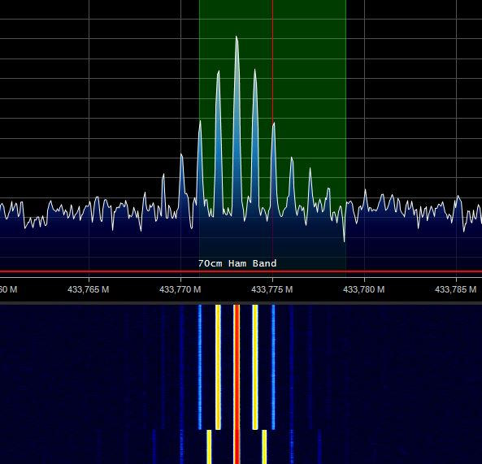
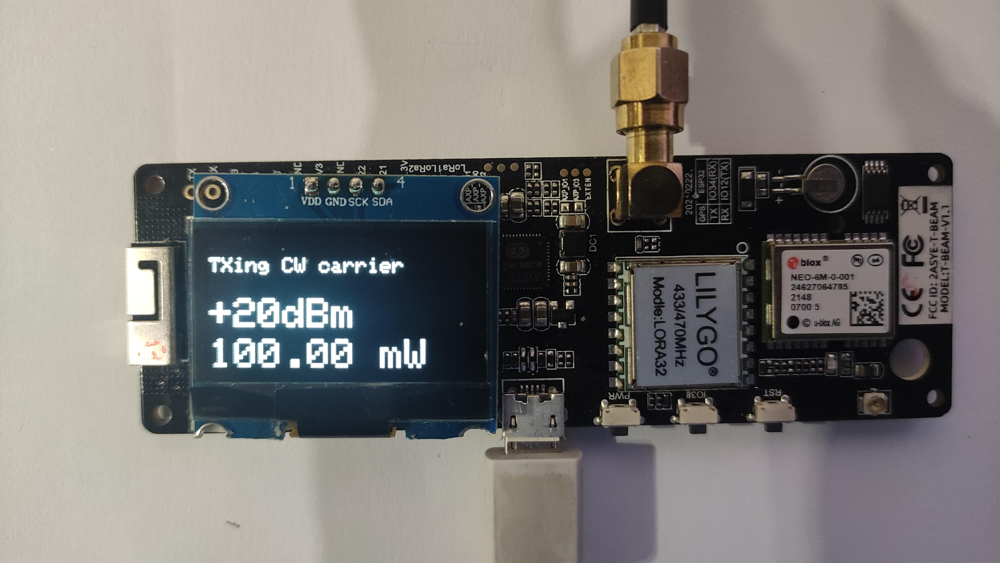

# What is it ?
A small software written for PlatformIO to be able to measure the output power and frequency of LoRa modules.

Tested on Lilygo T3 and Lilygo T-beam modules.

# Why ?
It's difficult to measure the real power of a broad RF signal and during packet transmission like used with LoRa APRS. It's easier to do that with a continuous carrier (CW).

It's even more difficult to get an idea of the frequency accuracy of the produced signal.

This software does cyclically produce a FM carrier at as many power levels you want, allowing to precisely measure the frequency and power.

# How ?
- Connect a test bench or a Wattmeter and frequency meter (with a dummy load) to the antenna connector.
- Load the software on Visual Studio Code with PlatformIO compiler.
- Change to settings to fit your board. (see below)
- Load the software
 
After initializings, the transmission will start immediately a carrier on 433.775 MHz (see settings).

It cyclically transmits at all power levels declared in the settings. Each step lasts the time set (2s by default) modulated with increasing audio frequency (by default 1000Hz at start).

You can now measure power and frequency. On the above sprectum, you can see that the frequency is a bit off and the 2 different tones used for the 2 powers.

All infos are available on the OLES screen as well as on the serial port at a speed of 115200 bauds.

# Settings
Change the settings on top of the script to fit to your board and needs.

    // If LilyGo T-beam board. Comment out for this board
    //#define Lilygo_tbeam
    // If LilyGo T3 board. Comment out for this board
    #define Lilygo_T3
    // defines the OLED driver type comment out if using SSD1306 driver. Comment if 1.3" inch uses SH11106
    #define ssd1306
    // TX delay in ms at each power
    int TXdelay   = 2000;
    // TX frequency in MHz
    double TXfreq = 433.775;
    // audio start frequency in Hz
    int TXtonebase = 1000;
    // audio step in Hz
    int TXtonestep = 100;
    // array in which all desired power levels are given in dBm
    const int PowerArray [] = {2,4,6,8,10,17,20};

ie. The upper lines are for a T3 module with a SSD1306 (on board) OLED.
    
> [!NOTE]
You must change the frequency, depending of your LoRa band supported by your LoRa module.

Feedbacks are welcome.  
