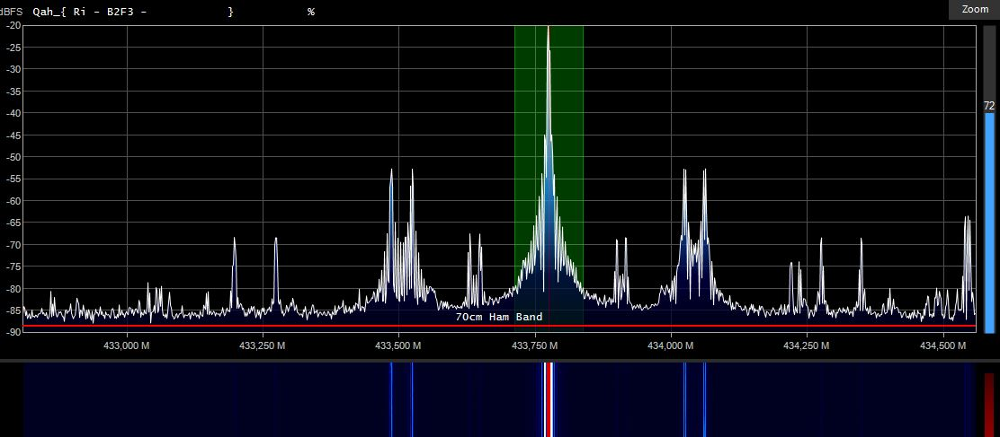

# TTGO-TX-power-test
A small software written for PlatformIO to be able to measure the output power and frequency of LoRa modules
Tested on Lilygo T3 and Lilygo T-beam modules.

# Why ?
It's difficult to measure the real power of a broad RF signal like used with LoRa APRS. It's easier to do that with a continuous carrier (CW).
It's even more difficult to get an idea of the frequency accuracy of the produced signal.
This software does produce a CW carrier at 2 different levels set to +20dBm and +10dBm during 10s allowing to precisely measure the frequency and power.

# How ?
- Connect a test bench or a Wattmeter and frequency meter (with a dummy load) to the antenna connector.
- Load the software on Visual Studio Code with PlatformIO compiler.
- Change to settings to fit your board. 
- Load the software
It will start immediately to send a carrier at +20dBm during 10s and than at +10dBm on 433.775 MHz. These are the default values that can be changed.
You can now measure power and frequency.

# Settings
Change the settings on top of the script to fit to your board and needs.

    //#define tbeam               // if LilyGo T-beam
    #define T3                  // if LilyGo T3 board
    #define ssd1306;            // defines the OLED driver type comment out if using SSD1306 driver. Comment if 1.3" inch uses SH11106
    int TXdelay   = 10000;      // TX delay in ms at each power
    double TXfreq = 433.775;    // frequency in MHz
    int TXpowerHi = 20;         // High power in dBm (max 20)
    int TXpowerLo = 10;         // Low power in dBm
    
> [!NOTE]
You must change the frequency, depending of your LoRa band supported by your LoRa module.

Feedbacks are welcome.  
